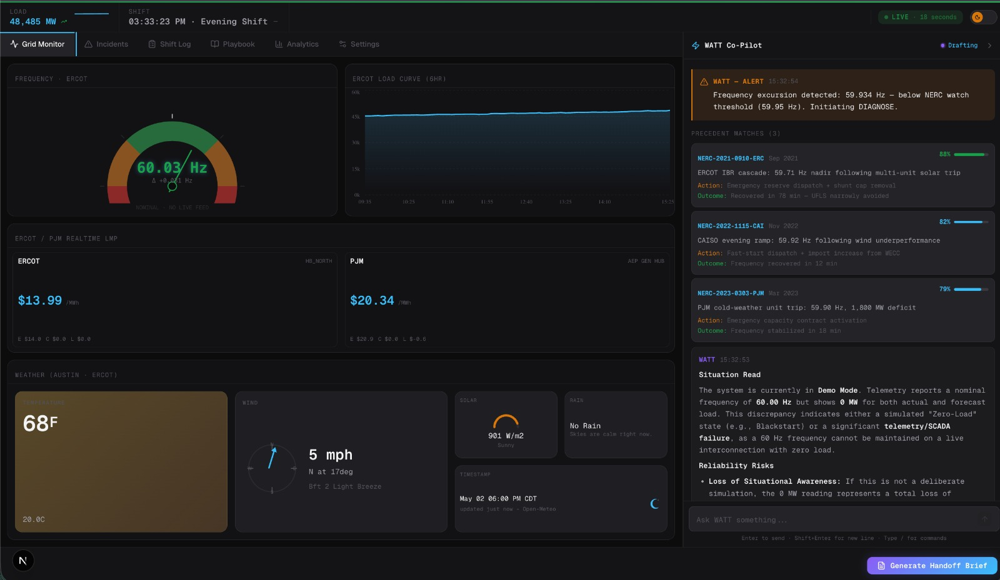
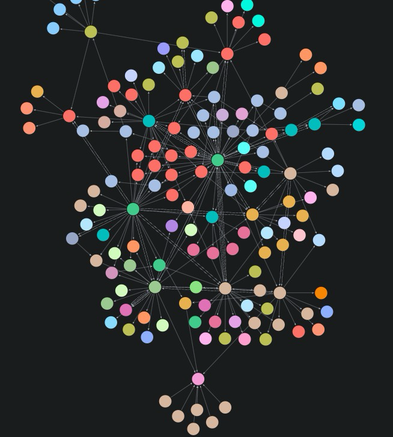
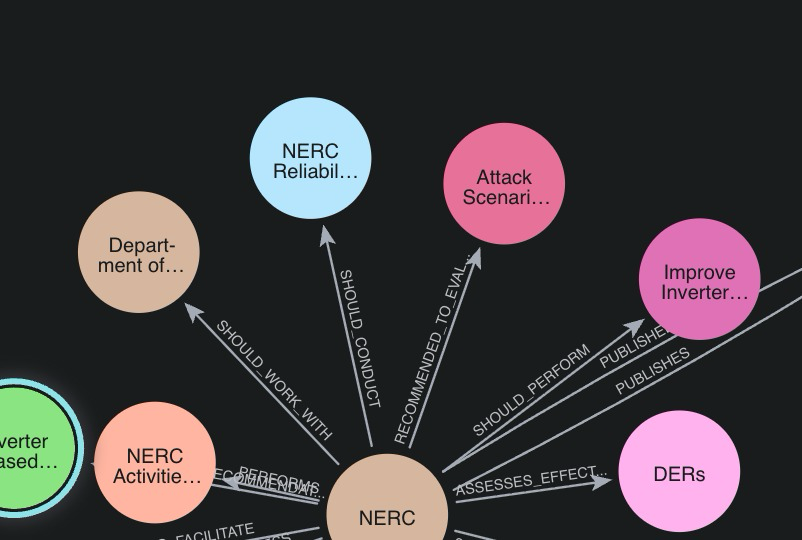

# GridSync (WATT: The Grid Operator's Co-Pilot)



> **The second brain for electric-grid reliability intelligence.**

## ⚠️ The Challenge: 2:00 AM at the Console

It's 2:00 AM on a Tuesday. Maria is the overnight shift operator at a regional transmission organization—keeping the lights on while the rest of us sleep. Her tools? SCADA screens, beeping consoles, and color-coded spreadsheets built in 1998.

Suddenly, a storm knocks out a transmission line in Texas. Three alarms fire simultaneously. Maria has **four minutes** to make a rerouting call affecting 800,000 homes. One wrong decision triggers a regional blackout.

We have more data on the grid than ever before, but the missing piece is how we support the humans processing it.

## 💡 The Solution: WATT

We didn't build another dashboard. We built a co-pilot—**WATT: the grid operator's second brain**.

WATT takes the stress out of the hardest job in the infrastructure sector. It goes beyond basic RAG (Retrieval-Augmented Generation) chatbots. WATT **watches** the grid over time, **reasons** through anomalies, **remembers** shift history, and knows when it doesn't know enough—so it asks.

## ⚡ Frontend & Dashboard Data Sources

Our high-performance **Next.js** frontend is built for speed and clarity.

- **Live Data Ingestion**: Pulls live data from **ERCOT**, **PJM**, and public **SCADA** feeds.
- **Trigger Mechanism**: The moment a threshold is breached, the app packages anomaly metrics and fires them to the AI instantly.
- **Agentic Orchestration**: The Deep Agents framework receives spike metrics, spins up reasoning to diagnose the problem, and drafts the dispatch order—all within seconds of detection.

## 🧠 NERC Data & Hybrid Memory Engine (`data_pipeline/`)

The grid has 30 years of **NERC** (North American Electric Reliability Corporation) incident reports. That is thousands of pages of historical failures, root causes, and solutions. Our AI understands the physics of the grid *and* the history of the incidents.

We use a **Hybrid Memory Engine** to extract meaningful details from unstructured NERC data:
- **Vector Database**: Holds semantic context—understanding the "why" and "how" of Maria's queries.
- **Graph Database**: Captures causal relationships between faults, substations, and threat scenarios.

### How it works: GraphRAG Retrieval
When an operator asks, *"Did NERC recommend to evaluate Attack Scenarios?"*
1. The Vector DB links "recommend to evaluate" with "guidelines" and "attack scenarios" with "threat scenarios."
2. The Graph DB instantly traverses the NERC relationship tree. It identifies that the `RiskProfile` node for "Security Risks" is explicitly linked via `COVERS_THREAT` edges to specific "Cyberattack" and "Physical Attack" nodes.

This allows the AI to hand the operator the exact causal chain and the historically proven solution, cutting through the 2:00 AM panic.

### Graph Database Visualizations


*Overview of the NERC relationship tree.*


*A closer look at specific causal relationships and nodes.*

---

## 🚀 Getting Started

Follow these instructions to run the GridSync platform locally.

### Backend Setup (`backend/`)

1. **Create and activate a Conda environment**:
   ```bash
   conda create -n gridsync python=3.11 -y
   conda activate gridsync
   ```

2. **Install dependencies**:
   From the repository root:
   ```bash
   pip install -r backend/requirements.txt
   ```

3. **Configure environment variables**:
   Create a `.env` file in the project root:
   ```env
   GEMINI_API_KEY=your_key_here
   QDRANT_URL=http://localhost:6333
   QDRANT_API_KEY=
   QDRANT_COLLECTION=nerc_event_analysis_reports
   BACKEND_HOST=0.0.0.0
   BACKEND_PORT=8000
   CORS_ORIGINS=http://localhost:3000,http://127.0.0.1:3000
   ```

4. **Run the API server**:
   From the `backend/` directory:
   ```bash
   cd backend
   uvicorn app.main:app --reload --host 0.0.0.0 --port 8000
   ```
   *The API will be available at `http://localhost:8000` (Swagger UI at `/docs`).*

### Frontend Setup (`frontend/`)

1. **Navigate to the frontend directory**:
   ```bash
   cd frontend
   ```

2. **Install dependencies**:
   ```bash
   npm install
   ```

3. **Run the development server**:
   ```bash
   npm run dev
   ```
   *The dashboard will be available at `http://localhost:3000`.*
